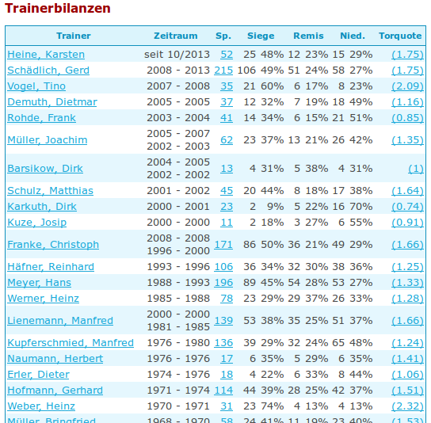
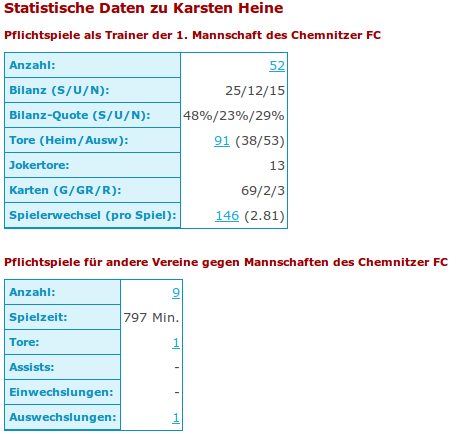
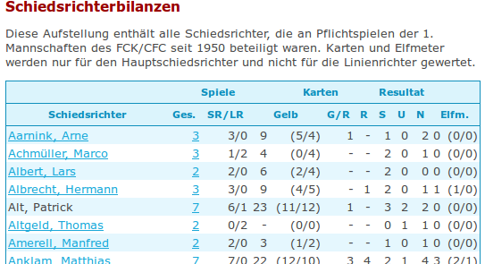
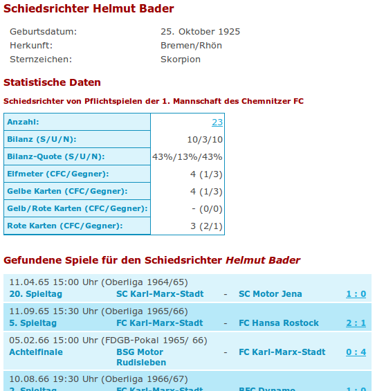

.. ==================================================
.. FOR YOUR INFORMATION
.. --------------------------------------------------
.. -*- coding: utf-8 -*- with BOM.

.. include:: ../Includes.txt

.. _statsdata:

Schnelleinstieg
===============

Die Extension ist so entwickelt worden, daß alle Auswertungen per Typoscript 
eingerichtet werden. Dadurch kann man sogar eigene Auswertungen integrieren. Durch 
diese Flexibilität wird die Extension aber auch recht komplex. Für eigene Anpassungen 
sollte man den mitgelieferten Typoscript-Code sehr genau studieren.

Für einen schnellen Einstieg liefert die Extension aber schon eine Reihe umfangreicher
Auswertungen mit. Diese Tour soll helfen, schnell zu den ersten Zahlen zu kommen.

Schritt 1: Extension installieren
---------------------------------
Die Extension wird wie üblich über den Extension Manager installiert. Für die Ausgabe 
der Daten im Frontend muss das Static Typoscript Template aktiviert sein.

.. figure:: ../Images/static-ts.png
   :alt: Include static typoscipt for t3sportstats.

Schritt 2: Daten bereitstellen
------------------------------
Bevor im Frontend Daten angezeigt werden können, müssen diese zunächst für die Statistik
aufbereitet werden. Dazu muss man im Backend-Modul von T3sports den Statistik-Cache leeren.
Der Button befindet sich immer neben der Wettbewerbsauswahl.

.. figure:: ../Images/clear-statistics-cache.png
   :alt: Button to clear statistics cache 

Die Daten werden immer komplett für einen Wettbewerb aufbereitet. Dazu werden alle vorhandenen
Daten gelöscht und dann neu angelegt. Wenn man also statistisch relevante Daten in einem Spiel 
löscht, dann muss man anschließend den Statistik-Cache des Wettbewerbs löschen, damit die 
Änderungen auch in der Statistik sichtbar werden.

Schritt 3: Statistik im Spieler einblenden
------------------------------------------
In der Extension cfc_league_fe sind die notwendigen Subparts bereits in den Templates der 
Personen enthalten. Sie müssen einfach mit eingebunden werden und die Daten sollten 
angezeigt werden.

Dabei werden nicht nur die Daten des Spielers angezeigt, die er für den eigenen Verein 
erzeugt hat. Sondern es werden, wenn vorhanden, auch die Spiele ausgewertet, die er gegen 
den eigenen Verein gespielt hat.

Schritt 4: Statistik mit Plugin anzeigen
----------------------------------------
Für umfangreiche Statistiken wird das Plugin *T3sports: Statistics* verwendet. Im ersten Tab
wählt man die gewünschte Statistik aus. Neben der Spielerstatistik, steht auch eine Auswertung 
für Trainer und Schiedsrichter bereit. Außerdem liefert die Datenbankstatistik ein paar 
allgemeine Zahlen über die gesammelten Spiele in der Datenbank. Im ersten Tab kann man den 
Datenscope wie gewohnt weiter einschränken.

Spielerstatistik
................
Per Typoscript kann man verschiedene Auswertungen zu den Spielern konfigurieren. Drei dieser
Konfigurationen werden schon mitgeliefert. Die Statistik **default** entspricht dem normalen 
Arbeitsnachweis der Spieler. Mit **scorerlist** werden die Torschützen angezeigt und mit 
**assistlist** die besten Vorlagengeber.

Die Option **Teamspieler hervorheben** kann genutzt werden, um in einer umfangreichen Spielerliste,
die Spieler eines bestimmten Teams hervorzuheben.

Trainerstatistik
................
Diese Statistik liefert Zahlen zur Bilanz der Trainer. Die folgenden Abbildungen sagen vermutlich
mehr als viele Worte.

Die Detailansicht eines Trainers:

Schiedsrichterstatistik
.......................
Auch für die Schiedsrichter und deren Assistenten werden Statistiken erstellt. Und auch hier
sollen die Abbildungen einen Eindruck des möglichen Umfangs liefern:

Die Detailansicht des Schiedsrichters:

