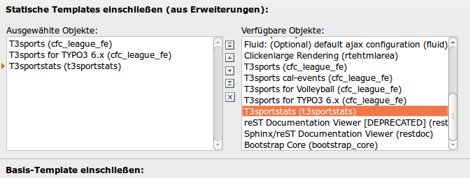
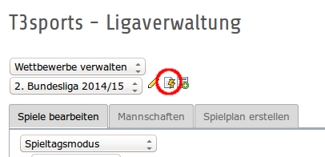

.. ==================================================
.. FOR YOUR INFORMATION
.. --------------------------------------------------
.. -*- coding: utf-8 -*- with BOM.

.. include:: ../Includes.txt

.. _statsdata:

Schnelleinstieg
===============

Die Extension ist so entwickelt worden, daß alle Auswertungen per Typoscript 
eingerichtet werden. Dadurch kann man sogar eigene Auswertungen integrieren. Durch 
diese Flexibilität wird die Extension aber auch recht komplex. Für eigene Anpassungen 
sollte man den mitgelieferten Typoscript-Code sehr genau studieren.

Für einen schnellen Einstieg liefert die Extension aber schon eine Reihe umfangreicher
Auswertungen mit. Diese Tour soll helfen, schnell zu den ersten Zahlen zu kommen.

Schritt 1: Extension installieren
---------------------------------
Die Extension wird wie üblich über den Extension Manager installiert. Für die Ausgabe 
der Daten im Frontend muss das Static Typoscript Template aktiviert sein.

Schritt 2: Daten bereitstellen
------------------------------
Bevor im Frontend Daten angezeigt werden können, müssen diese zunächst für die Statistik
aufbereitet werden. Dazu muss man im Backend-Modul von T3sports den Statistik-Cache leeren.
Der Button befindet sich immer neben der Wettbewerbsauswahl.

Die Daten werden immer komplett für einen Wettbewerb aufbereitet. Dazu werden alle vorhandenen
Daten gelöscht und dann neu angelegt. Wenn man also statistisch relevante Daten in einem Spiel 
löscht, dann muss man anschließend den Statistik-Cache des Wettbewerbs löschen, damit die 
Änderungen auch in der Statistik sichtbar werden.

Schritt 3: Statistik im Spieler einblenden
------------------------------------------
